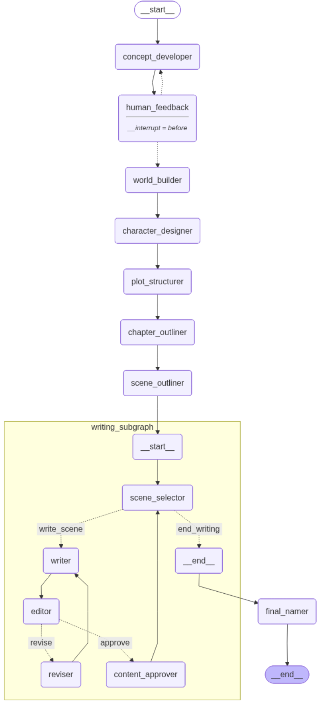
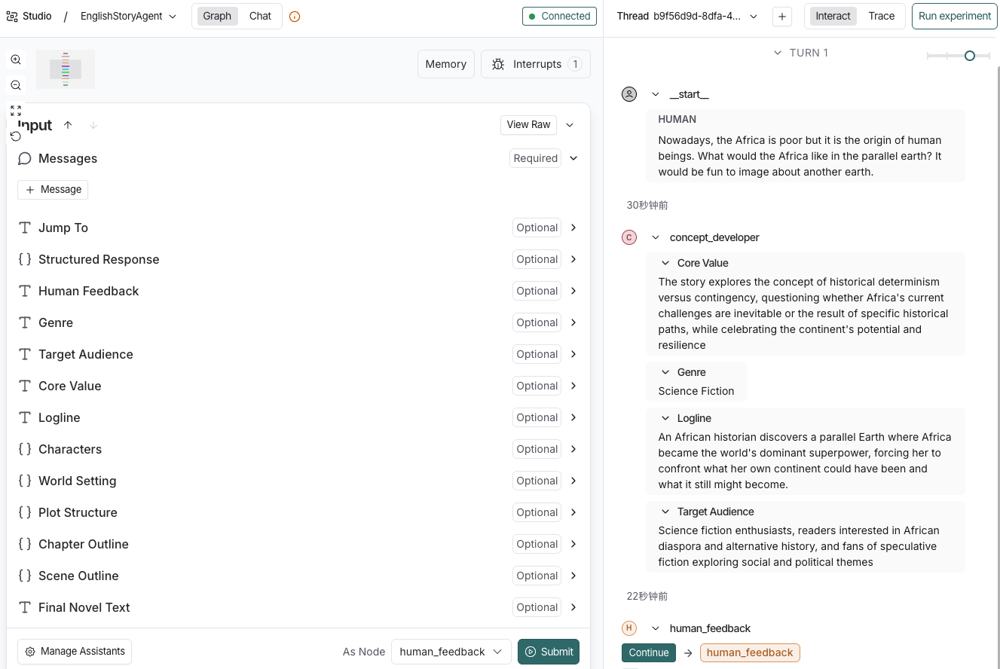

# 1_LongStoryWriter

[Chinese README](./README_Chinese.md)

> AI Long-Form Story Writing Agent based on **LangGraph**: A complete, referenceable multi-agent collaboration system implementation supporting automatic generation of Chinese and English novels.


## 📖 Project Overview

**1_LongStoryWriter** is a multi-agent collaboration system built on [LangGraph](https://langchain-ai.github.io/langgraph/) specifically designed for AI-driven long-form story and novel creation. This project demonstrates how to decompose complex creative workflows into multiple specialized nodes through `NovelState` and conditional edges for efficient collaboration and decision-making.

### 🎯 Key Features

- **Bilingual Support**: Complete support for both Chinese and English creation workflows
- **State Management**: State management based on LangGraph, supporting workflow pause, resume, and checkpoints
- **Human Feedback Mechanism**: Integrated human review nodes to ensure generated content meets expectations
- **Long-Form Generation**: Verified capable of generating novels with 200,000 words (English) and 750,000 characters (Chinese)
- **Modular Design**: Clear code structure, easy to understand, modify, and extend
- **Complex Agent Architecture**: 10+ nodes and subgraphs with specific roles, covering the complete process from concept development to final book

### 📚 Generation Examples

The project has successfully generated two long-form novels as demonstrations:

- **"The Broken Heavens Covenant"**: A 753,808-character dystopian cultivation novel (Chinese)
- **"The Whisperer in the Archive"**: A 225,816-word science fiction novel (English)

Generated novels are located in the `out/` directory, including both Markdown and PDF formats.

## 🏗️ System Architecture



### Agent Components

The project simulates real-world novel conception and writing processes, containing the following core nodes:

1. **Concept Developer** - Determines novel genre, target audience, core values
2. **World Builder** - Constructs story world settings
3. **Character Designer** - Designs main characters and their backgrounds
4. **Plot Structurer** - Plans three-act structure
5. **Chapter Outliner** - Creates chapter outlines
6. **Scene Outliner** - Creates detailed scene outlines
7. **Writing Subgraph** - Writes content for each scene:
   1. **Scene Selector** - Selects the next scene to write
   2. **Writer** - Writes scene content and revises drafts based on editor suggestions
   3. **Editor** - Reviews draft quality
   4. **Reviser** - Records revision counts
   5. **Content Approver** - Writes approved scene content into final text
8. **Namer** - Gives the novel a catchy name

### Workflow

```
User Input → Concept Development → World Building → Character Design → Plot Structure
    ↓
Chapter Outlines → Scene Outlines → [Scene Writing Loop]
    ↓
Final Naming → Completion
```

**Core Creative Loop**:

```
Scene Selection → Writing → Editing → [Approval? → Finalization | Revision → Up to 3 cycles]
```

## 🚀 Quick Start

### Prerequisites

- Python 3.13 or higher
- DeepSeek API Key or configuration for other LLMs
- uv

### Installation

1. **Clone the project**

```bash
git clone https://github.com/your-username/1_LongStoryWriter.git
cd 1_LongStoryWriter
```

2. **Create and activate virtual environment**

```bash
python -m venv .venv
source .venv/bin/activate  # Linux/Mac
# or
.venv\Scripts\activate  # Windows
```

3. **Install dependencies**

```bash
# Using uv (recommended)
uv sync
uv pip install -e .
```

4. **Configure API Key**

Create a `.env` file and fill in your DeepSeek API Key (other LLMs can also be used):

```bash
cp .env.example .env
```

Edit the `.env` file:

```env
LANGSMITH_PROJECT=long-story-graph
DEEPSEEK_API_KEY=your_api_key_here
```

### Running the Project

#### 1) Jupyter Notebook

The project provides two Jupyter Notebook examples:

```bash
# Chinese creation
jupyter notebook notebook/notebook_ChineseStory.ipynb
# English creation
jupyter notebook notebook/notebook_EnglishStory.ipynb
```

#### 2) Langgraph Studio

The project is configured with `langgraph.json`. As long as you have installed `langgraph-cli` and `langgraph-api`, you can run it:

```bash
# Run langgraph studio
langgraph dev
```



## 📁 Project Structure

```markdown
1_LongStoryWriter/
├── notebook/                # Jupyter demonstration notebooks
│   ├── notebook_ChineseStory.ipynb    # Chinese novel generation notebook example
│   ├── notebook_EnglishStory.ipynb    # English novel generation notebook example
├── out/                     # Output directory
│   ├── AI_Novel_Chinese.md  # Generated Chinese novel
│   ├── AI_Novel_Chinese.pdf # Chinese novel PDF
│   ├── AI_Novel_English.md  # Generated English novel
│   ├── AI_novel_English.pdf # English novel PDF
├── src/                     # Source code
│   ├── Chinese_Story/       # Chinese story module
│   │   ├── graph.py         # Chinese story graph definition
│   │   ├── state.py         # Chinese state definition
│   │   └── prompts.py       # Chinese prompts
│   └── English_Story/       # English story module
│       ├── graph.py         # English story graph definition
│       ├── state.py         # English state definition
│       └── prompts.py       # English prompts
├── .env.example             # Environment variable example
├── pyproject.toml           # Python project configuration
├── uv.lock                  # Python project configuration
├── requirements.txt         # Dependency list
├── langgraph.json           # LangGraph configuration
└── README.md                # English project documentation
└── README_Chinese.md        # Chinese project documentation
```

## 🧠 Core Concepts

### State Management

The project extends LangGraph's `AgentState` to create a custom `NovelState` for managing the entire creative workflow. Main states include:

- `concept`: Novel concept description
- `world_setting`: World setting
- `characters`: Character list
- `plot_structure`: Plot structure (three acts)
- `chapters`: Chapter outlines
- `scenes`: Scene outlines
- `current_chapter`: Current chapter index
- `current_scene`: Current scene index
- `scene_contents`: Scene contents
- `novel_title`: Novel title
- `human_feedback`: Human feedback

### Conditional Edges

LangGraph's conditional edge mechanism is used to implement intelligent decision-making:

- **Human feedback loop**: When users are dissatisfied with initial concept design, regenerate based on user feedback
- **Scene selection**: After completing current scene, automatically select next scene
- **AI review feedback**: When AI editor is dissatisfied with draft, return to writer for further revisions
- **Final naming**: After all chapters are completed, enter naming phase

## 🤖 Customizing Agents

1. You can customize agent behavior by modifying prompts in `prompts.py`:

2. You can also customize the creative workflow by modifying graph definitions in `graph.py`:

   ```python
   # Add new node
   workflow = StateGraph(NovelState)
   workflow.add_node("new_agent", new_agent_node)
   workflow.add_edge("existing_node", "new_agent")
   ```

## 🔧 Configuration Explanation

### langgraph.json

```json
{
    "graphs": {
        "ChineseStoryAgent": "./src/Chinese_Story/graph.py:graph",
        "EnglishStoryAgent": "./src/English_Story/graph.py:graph"
    },
    "env": ".env",
    "python_version": "3.13",
    "dependencies": ["."]
}
```

This configuration file defines two LangGraph Agents: `ChineseStoryAgent` and `EnglishStoryAgent`, for Chinese and English novel creation respectively.

## 📊 Performance Data

Based on actual running results in the project:

- **Chinese Novel**: 753,808 characters, 30 chapters
- **English Novel**: 225,816 words
- **Creation Time**: Approximately 4-6 hours (depending on API response speed)
- **Token Usage**: Approximately 2-3 million tokens

> ⚠️ **Note**: Long-form novel generation requires extensive API calls. Please ensure sufficient API quota before starting.

## 📄 License

This project is licensed under the MIT License - see the [LICENSE](LICENSE) file for details.

## 🙏 Acknowledgments

- [LangGraph](https://langchain-ai.github.io/langgraph/) - Powerful stateful workflow framework
- [DeepSeek](https://deepseek.com) - Excellent language model API
- [Jupyter Notebook](https://jupyter.org) - Interactive development environment

---

**Start your AI writing journey now!** 🚀