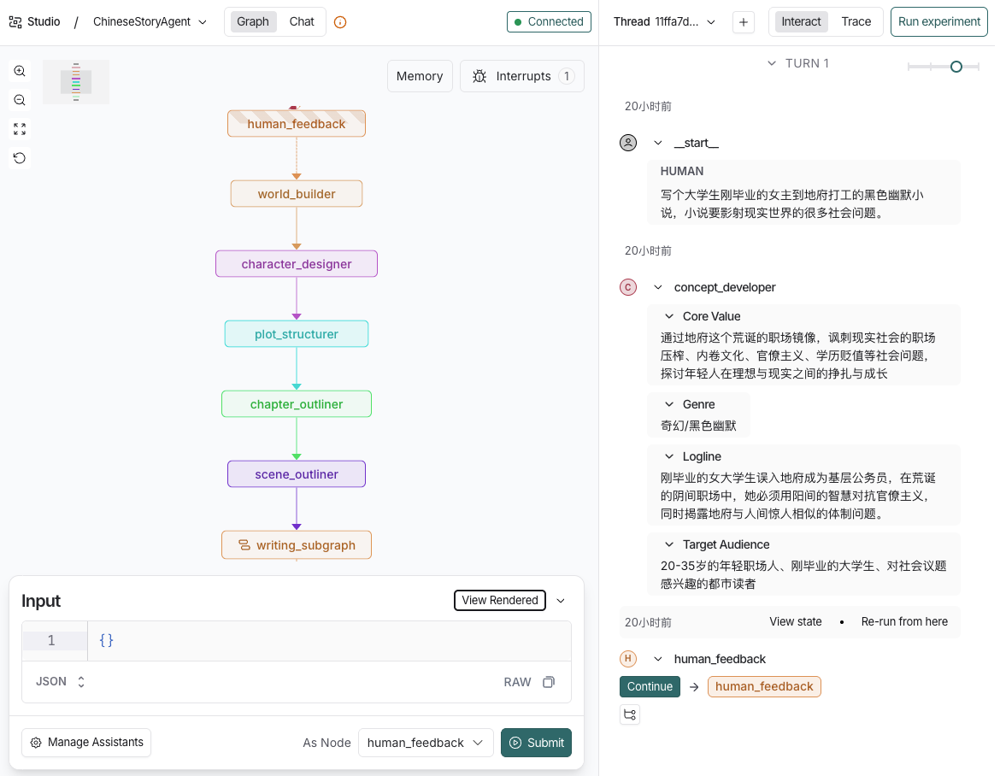

# 1_LongStoryWriter

[English README](./README.md)

> 基于 LangGraph 的 AI 长篇故事写作 Agent：一个完整的、可参考的多智能体协作系统实现，支持中文和英文长篇小说的自动生成。


## 📖 项目概述

**1_LongStoryWriter** 是一个基于 [LangGraph](https://langchain-ai.github.io/langgraph/) 构建的多智能体协作系统，专门用于 AI 驱动的长篇故事和小说创作。该项目展示了如何将复杂的创作流程分解为多个专业节点（Nodes），通过 `NovelState` 状态和条件边实现高效的协作与决策。

### 🎯 核心特色

- **双语支持**：完整支持中文和英文两种语言的创作流程
- **状态化管理**：基于 LangGraph 的状态管理，支持创作流程的暂停、恢复和检查点
- **人类反馈机制**：集成人工审核节点，确保生成内容符合预期
- **长篇生成**：已验证可生成 20 万词（英文）和 75 万字（中文）的长篇小说
- **模块化设计**：清晰的代码结构，易于理解、修改和扩展
- **复杂智能体架构**：10+ 个节点和子图各司其职，覆盖从概念开发到最终成书的完整流程

### 📚 生成示例

项目已成功生成两部长篇小说作为演示：

- **《破天契》**：一部 753,808 字的反乌托邦修仙小说（中文）
- **《The Whisperer in the Archive》**：一部 225,816 词的科幻小说（英文）

生成的小说位于 `out/` 目录，包含 Markdown 和 PDF 格式。

## 🏗️ 系统架构


### 智能体组成

项目模拟现实世界小说构思及撰写流程，包含以下核心节点：

1. **概念开发者 (Concept Developer)** - 确定小说类型、目标读者、核心价值
2. **世界观构建师 (World Builder)** - 构建故事的世界观设定
3. **角色设计师 (Character Designer)** - 设计核心角色及其背景
4. **情节架构师 (Plot Structurer)** - 规划三幕剧结构
5. **章节大纲师 (Chapter Outliner)** - 创建章节大纲
6. **场景大纲师 (Scene Outliner)** - 创建详细场景大纲
7. **小说撰写子图 (Writing Subgraph) **：为每个场景撰写内容
   1. **场景选择器 (Scene Selector)** - 选择下一个要撰写的场景
   2. **作家 (Writer)** - 撰写场景内容，并根据编辑建议修改草稿
   3. **编辑 (Editor)** - 审核草稿质量
   4. **修订者 (Reviser)** - 记录修订次数
   5. **定稿 (Content Approver)** - 将场景的草稿内容写入最终文本

8. **故事命名师 (Namer)** - 为小说取一个响亮的名字

### 工作流程

```
用户输入 → 概念开发 → 世界观构建 → 角色设计 → 情节架构
    ↓
章节大纲 → 场景大纲 → [场景写作循环]
    ↓
最终命名 → 完成
```

**核心创作循环**：

```
场景选择 → 写作 → 编辑 → [批准? → 定稿 | 修订 → 最多3次循环]
```

## 🚀 快速开始

### 前置要求

- Python 3.13 或更高版本
- DeepSeek API Key 或其他大模型的配置
- uv

### 安装

1. **克隆项目**

```bash
git clone https://github.com/your-username/1_LongStoryWriter.git
cd 1_LongStoryWriter
```

2. **创建并激活虚拟环境**

```bash
python -m venv .venv
source .venv/bin/activate  # Linux/Mac 
#或 
.venv\Scripts\activate  # Windows
```

3. **安装依赖**

```bash
# 使用 uv（推荐）
uv sync
uv pip install -e .
```

4. **配置 API Key**

创建 `.env` 文件并填入你的 DeepSeek API Key (也可以使用其他的大模型)：

```bash
cp .env.example .env
```

编辑 `.env` 文件：

```env
LANGSMITH_PROJECT=long-story-graph
DEEPSEEK_API_KEY=your_api_key_here
```

### 运行

#### 1) Jupyter Notebook

项目提供两个 Jupyter Notebook 示例：

```bash
# 中文创作
jupyter notebook notebook/notebook_ChineseStory.ipynb
# 英文创作
jupyter notebook notebook/notebook_EnglishStory.ipynb
```

#### 2) Langgraph Studio

项目已配置了 `langgraph.json`，只要安装了 `langgraph-cli` 和`langgraph-api` 便可运行：

```bash
# 运行 langgraph studio
langgraph dev
```



## 📁 项目结构

```markdown
1_LongStoryWriter/
├── notebook/                # Jupyter 演示笔记本
│   ├── notebook_ChineseStory.ipynb    # 中文小说生成的笔记本示例
│   ├── notebook_EnglishStory.ipynb    # 英文小说生成的笔记本示例
├── out/                     # 输出目录
│   ├── AI_Novel_Chinese.md  # 生成的中文小说
│   ├── AI_Novel_Chinese.pdf # 中文小说 PDF
│   ├── AI_Novel_English.md  # 生成的英文小说
│   ├── AI_novel_English.pdf # 英文小说 PDF
├── src/                     # 源代码
│   ├── Chinese_Story/       # 中文故事模块
│   │   ├── graph.py         # 中文故事图定义
│   │   ├── state.py         # 中文状态定义
│   │   └── prompts.py       # 中文提示词
│   └── English_Story/       # 英文故事模块
│       ├── graph.py         # 英文故事图定义
│       ├── state.py         # 英文状态定义
│       └── prompts.py       # 英文提示词
├── .env.example             # 环境变量示例
├── pyproject.toml           # Python 项目配置
├── uv.lock                  # Python 项目配置
├── requirements.txt         # 依赖列表
├── langgraph.json           # LangGraph 配置
└── README.md                # 英文项目说明
└── README_Chinese.md        # 中文项目说明
```

## 🧠 核心概念

### 状态管理

项目以 LangGraph 的 `AgentState` 为基础自定义了 `NovelState` 来管理整个创作流程的状态。主要状态包括：

- `concept`: 小说概念描述
- `world_setting`: 世界观设定
- `characters`: 角色列表
- `plot_structure`: 情节结构（三幕剧）
- `chapters`: 章节大纲
- `scenes`: 场景大纲
- `current_chapter`: 当前章节索引
- `current_scene`: 当前场景索引
- `scene_contents`: 场景内容
- `novel_title`: 小说标题
- `human_feedback`: 人工反馈

### 条件边

LangGraph 的条件边机制用于实现智能决策：

- **人工反馈循环**：当用户不满意开始的概念设计时，根据用户意见重新生成
- **场景选择**：完成当前场景后，自动选择下一个场景
- **AI审核反馈**：当AI编辑不满意草稿时，返回给作家继续修改
- **最终命名**：所有章节完成后，进入命名阶段

## 🤖 自定义智能体

1. 你可以通过修改 `prompts.py` 中的提示词来自定义智能体的行为：

2. 你也可以通过修改 `graph.py` 中的图定义，自定义创作流程：

   ```python
   # 添加新的节点
   workflow = StateGraph(NovelState)
   workflow.add_node("new_agent", new_agent_node)
   workflow.add_edge("existing_node", "new_agent")
   ```

## 🔧 配置说明

### langgraph.json

```json
{
    "graphs": {
        "ChineseStoryAgent": "./src/Chinese_Story/graph.py:graph",
        "EnglishStoryAgent": "./src/English_Story/graph.py:graph"
    },
    "env": ".env",
    "python_version": "3.13",
    "dependencies": ["."]
}
```

这个配置文件定义了两个 LangGraph Agent：`ChineseStoryAgent` 和 `EnglishStoryAgent`，分别用于中文和英文小说创作。

## 📊 性能数据

基于项目中的实际运行结果：

- **中文小说**：753,808 字，共 30 章
- **英文小说**：225,816 词
- **创作时间**：约 4-6 小时（取决于 API 响应速度）
- **Token 使用量**：约 200-300 万 tokens

> ⚠️ **注意**：长篇小说生成需要大量 API 调用，建议在开始前确认 API 配额充足。

## 📄 许可证

本项目采用 MIT 许可证 - 查看 [LICENSE](../LICENSE) 文件了解详情。

## 🙏 致谢

- [LangGraph](https://langchain-ai.github.io/langgraph/) - 强大的状态化工作流框架
- [DeepSeek](https://deepseek.com) - 优秀的语言模型 API
- [Jupyter Notebook](https://jupyter.org) - 交互式开发环境

---

**开始你的 AI 写作之旅吧！** 🚀