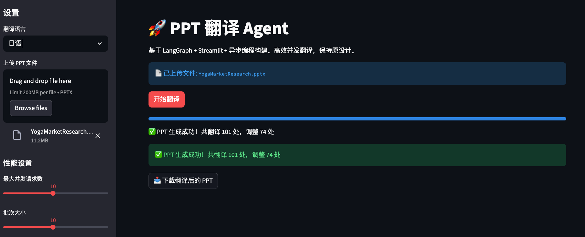
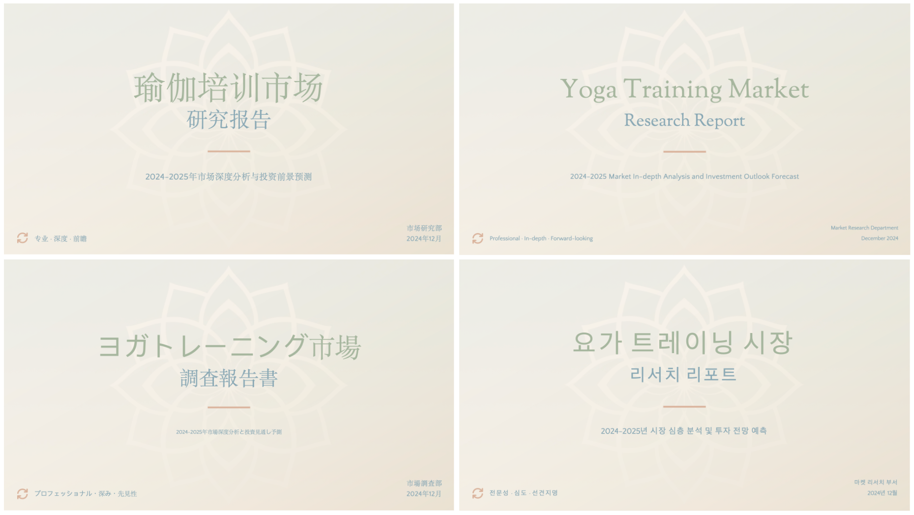

# PPT 翻译 Agent

[English README](./README.md)

基于 Streamlit 构建的强大 Web 应用程序，能够智能翻译 PowerPoint 演示文稿的文本框（暂不支持翻译表格、SmartArt、图表等），同时保持原始设计和格式。该项目利用 LangGraph 进行工作流编排，支持多个大语言模型提供商，提供高质量的翻译服务。






## 🚀 主要特性

- **智能翻译**: 使用先进的大语言模型提供专业质量的翻译
- **设计保持**: 维持原始 PPT 布局、格式和样式
- **多语言支持**: 英文、中文、日文、韩文
- **并发处理**: 高效的批量翻译，可配置并发数
- **视觉宽度智能**: 自动调整中日韩文字与拉丁文字的字体大小
- **专业格式化**: 保持阿拉伯数字、品牌名称和商务语气
- **Web 界面**: 用户友好的 Streamlit 界面，带进度跟踪

## 📋 系统要求

- Python 3.12
- Streamlit
- LangGraph
- LangChain
- python-pptx
- python-dotenv
- asyncio

## 🔧 安装步骤

1. **克隆仓库:**
   ```bash
   git clone https://github.com/Carinalin/HelloAgents.git
   cd 2_SlidesTranslator
   ```

2. **安装依赖:**
   ```bash
   pip install -r requirements.txt
   ```
   
3. **配置 API 密钥:**
   - 在项目根目录创建 `.env` 文件
   - 添加您的大语言模型提供商 API 密钥:

## 🚀 使用方法

### 启动 Web 应用

```bash
streamlit run app.py
```

### 使用步骤

1. **上传 PPT**: 使用文件上传器上传您的 PowerPoint 演示文稿 (.pptx)
2. **选择目标语言**: 从英文、中文、日文或韩文中选择
3. **配置性能**: 调整并发数和批处理大小设置
4. **开始翻译**: 点击"开始翻译"并监控进度
5. **下载结果**: 下载保持格式的翻译后 PPT

### 支持的大语言模型提供商

应用程序支持多个大语言模型提供商（可根据需要在`models.py`中添加其他供应商）:
- **DeepSeek**: 默认提供商
- **OpenAI**: GPT-3.5-turbo、GPT-4 等
- **Anthropic**: Claude 系列模型
- **Grok (XAI)**: Grok 系列模型

## ⚙️ 配置说明

### 环境变量

在 `.env` 文件中创建您的 API 密钥:

```env
# 大语言模型提供商 API 密钥
DEEPSEEK_API_KEY=your_deepseek_api_key_here
OPENAI_API_KEY=your_openai_api_key_here
ANTHROPIC_API_KEY=your_anthropic_api_key_here
XAI_API_KEY=your_xai_api_key_here
```

### 性能设置

- **最大并发请求数**: 1-20 (默认: 10)
- **批处理大小**: 1-10 (默认: 5)

较高的值提供更快的处理速度，但可能增加 API 成本和速率限制。

## 🏗️ 架构设计

```
2_SlidesTranslator/
├── app.py                    # 主 Streamlit 应用
├── models.py                 # 大语言模型配置和初始化
├── graph.py                  # LangGraph 工作流编排
├── utils.py                  # PPT 操作工具
├── prompts/
│   └── translation_instruction.txt  # 翻译提示模板
├── template/                 # 示例 PPT 文件
└── .env                      # 环境变量(自行创建)
```

### 核心组件

1. **app.py**: 带有文件上传、语言选择和进度跟踪的 Streamlit Web 界面
2. **graph.py**: 三阶段工作流 - 解析 → 翻译 → 重建
3. **utils.py**: 高级 PPT 操作，包括视觉宽度计算和布局优化
4. **models.py**: 多提供商大语言模型配置和环境变量管理

### 翻译工作流

1. **解析 PPT**: 提取 PowerPoint 幻灯片中的文本及位置和格式数据
2. **翻译**: 使用异步大语言模型调用，智能批处理和重试逻辑
3. **重建**: 智能重建包含翻译文本的 PPT，根据需要调整布局

## 🧠 智能功能

### 视觉宽度智能
- 自动计算中日韩文字与拉丁文字的视觉宽度差异
- 调整字体大小防止文本溢出
- 维持文本框比例和布局完整性

### 专业翻译规则
- 保持阿拉伯数字不变 (例如 "500" 保持为 "500")
- 适当维护品牌/产品名称
- 专业的商务语气
- 简洁的演示文稿友好输出

### 布局优化
- 基于文本长度比例的动态字体大小调整
- 文本框碰撞检测
- 一致格式的分组处理
- 智能文本换行和溢出处理

## 📊 性能特点

- **并发处理**: 可配置的批处理大小，实现高效的 API 使用
- **进度跟踪**: 翻译过程中的实时进度更新
- **内存高效**: 大型演示文稿的临时文件处理
- **错误处理**: 健壮的重试逻辑和优雅的错误恢复

## 🤝 贡献指南

1. Fork 仓库
2. 创建功能分支
3. 进行修改
4. 为新功能添加测试
5. 提交 Pull Request

## 📄 许可证

本项目采用 MIT 许可证。

## 🙏 致谢

- Streamlit 提供 Web 框架
- LangGraph 提供工作流编排
- python-pptx 提供 PowerPoint 操作
- 各大语言模型提供商提供翻译能力

## 🐛 故障排除

### 常见问题

1. **API 密钥错误**: 确保您的 `.env` 文件包含有效的 API 密钥
2. **文件上传问题**: 验证文件是有效的 .pptx 格式
3. **翻译质量**: 在 `models.py` 中调整温度参数
4. **性能问题**: 增加批处理大小以获得更快的处理速度 (可能增加成本)

### 获取帮助

- 检查控制台以获取详细的错误消息
- 使用您的提供商验证 API 密钥的有效性
- 确保您的使用有足够的 API 速率限制

## 📞 联系方式

如有疑问和支持需求，请在仓库中提交 issue 或联系维护者
